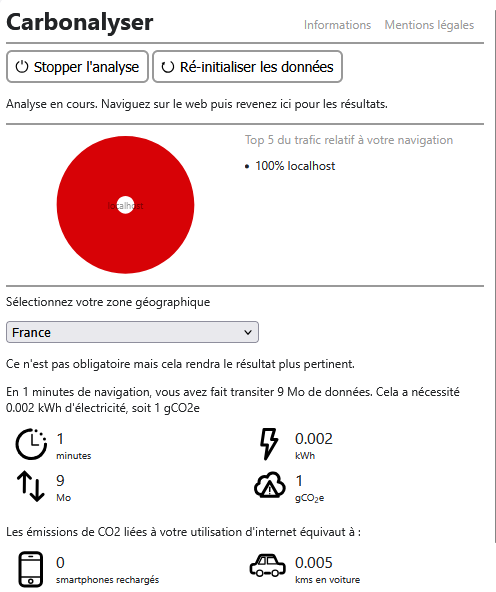
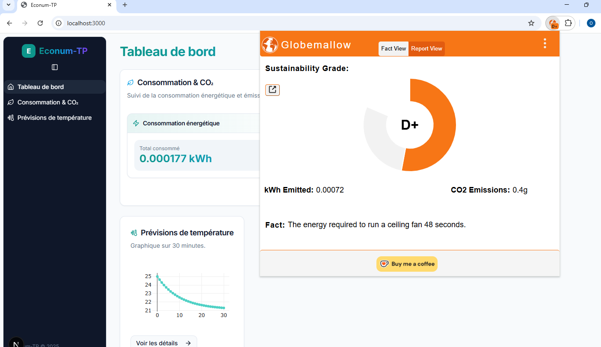
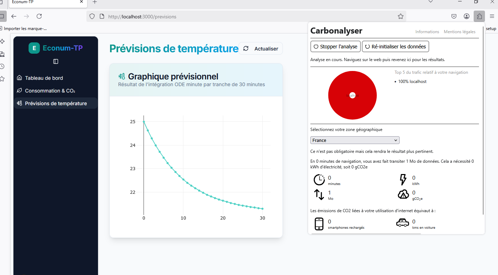

# Rapport de projet

## Architecture du projet

### Backend
- API dans `Back-end/`
    - `main.py` : Serveur FastAPI
    - `Solver.py` : Calcul des températures

    - `notebook.ipynb` : Tests
    - `cython/` : Optimisation avec cython
    - `requirement.txt` : Dépendances

### Frontend
- Application React dans `Frontend/`
- Connexion au backend via appels API

> Le backend et le frontend sont séparés dans des sous-dossiers du même dépôt.

## Performances algorithmiques

| Testcase | CPU | RAM | Énergie | CO2 | Temps d’exécution | Temps de code | Complexité |
|----------|-----|-----|---------|-----|-------------------|---------------|------------|
| Python | ~0.0217 kWh | ~0.0006 kWh | ~0.02336 kWh | ~0.001 kg | ~217.1s | 45 min | *** |
| Scipy odeint | ~7.33e-07 kWh | ~6.66e-09 kWh | ~7.39e-07 kWh | ~4.14e-08 kg | ~0.009s | 30 min | ** |
| Numba | ~0.0014 kWh | ~4.03e-05 kWh | ~0.0016 kWh | ~8.83e-05 kg | ~14.5s | 5 min | * |
| Cython | ~0.0031 kWh | ~8.55e-05 kWh | ~0.0032 kWh | ~0.0002 kg | ~15.4s | 1h | **** |

### Prévision 30x1min vs 1x30min

| Méthode | Énergie | CO2 | Temps |
|---------|---------|-----|-------|
| 30x1min | ~0.0217 kWh | ~0.001 kg | ~217.1s |
| 1x30min | ~0.014 kWh | ~0.0008 kg | ~140.3s |

### Backend : consommation par utilisateurs

| Charge | Conso (kWh) |
|--------|-------------|
| 10 utilisateurs/min | 0.008933 |
| 100 utilisateurs/min | 0.006447 |
| 1000 utilisateurs/min (cache) | 0.001754 |

## Empreinte énergétique du frontend

### Carbonalyser

### Globemallow

### Impact du cache

